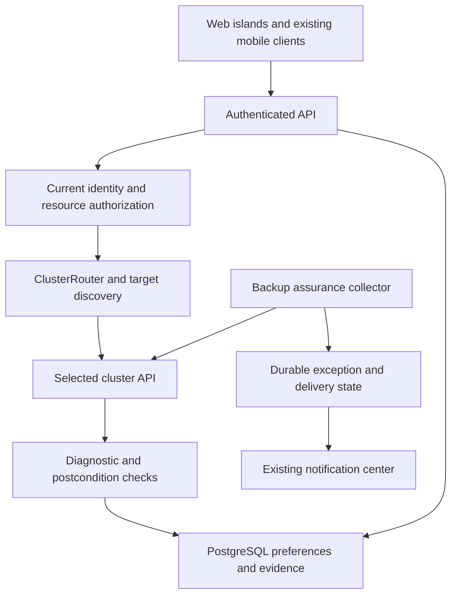
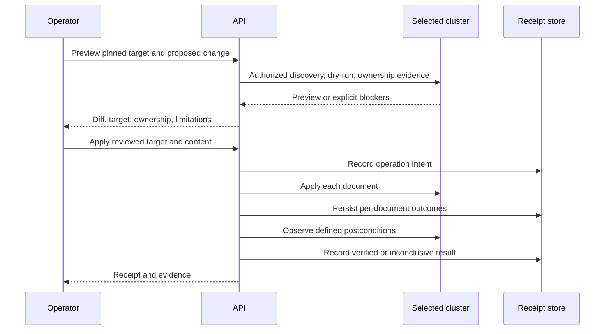
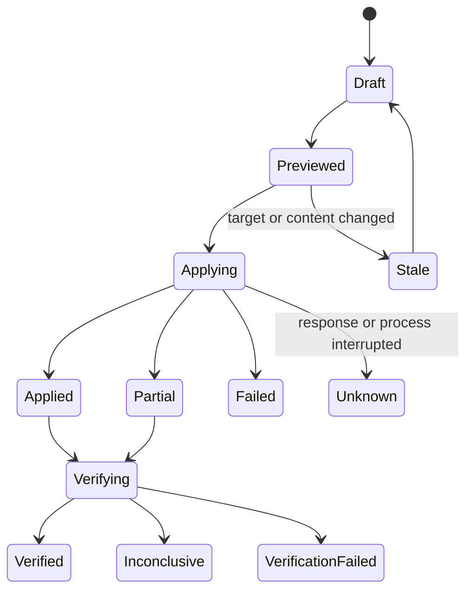

# k8sCenter Feature Expansion - Plan

## Goal Capsule

**Objective:** Make routine Kubernetes management repeatable, complete the most visible workflow gaps, and preserve evidence that changes and recovery actions achieved their intended outcomes.

**Means:** Deliver six related feature tracks in small releases: saved workspaces; remote-cluster parity; External Secrets investigation; persistent incident records; GitOps-aware changes; and recovery readiness.

**Planning boundary:** This document plans all six directions accepted in the discussion. It does not authorize implementation, cluster mutations, repository publishing, or restore exercises. Technical defaults below are proposed design decisions; the user has approved the structure, not every default.

**Readiness:** Detailed planning draft. Near-term units have file boundaries, dependencies, and acceptance tests. The complete roadmap remains requirements-only because the retention/access choices in Q1 and the restore-environment choices in Q3 require confirmation before their affected releases. Work on unrelated tracks need not wait for those decisions.

**Authority:** Product requirements define behavior; technical decisions define mechanisms; implementation units implement both. Existing security and cluster-routing contracts remain binding. If implementation evidence contradicts a proposed approach, revise that approach before continuing.

**Completion:** Each selected release meets its acceptance examples and Verification Contract. The entire roadmap is complete only when every in-scope track is delivered or its scope is explicitly revised; shipping the first track does not complete this plan.

---

## Product Contract

### Summary

Add persistent personal operating context, make remote capabilities explicit, finish ESO evidence screens, preserve investigations, track change outcomes, and surface backup exceptions. Develop restore rehearsals as a separate, gated extension after verifying a specific destination and application recovery contract.

### Problem Frame

The repository has broad integration coverage, but users still reconstruct working context and cross disconnected screens to investigate problems. Some operations reject remote clusters after the user has already selected one. ESO detail pages expose unfinished tabs even though the backend persists part of the needed evidence. Current diagnostics and apply results do not provide a durable, connected investigation or change record.

### Confirmed Baseline

Source reviewed at local main revision `b9eb8171`; no live cluster or mobile-store readiness was tested.

| Track | Existing foundation | Verified gap or boundary |
|---|---|---|
| Saved workspaces | Resource tables, cluster selection, DashboardV2, command palette | Saved views, pins, and custom layouts remain pending in `CLAUDE.md` |
| Remote operations | ClusterRouter, encrypted credentials, impersonation, eviction callbacks | YAML validate/apply/diff/export and pod exec reject remote clusters; dashboard summary is local-only |
| ESO investigation | CRD inventory, drift, refresh actions, persisted ES history | Live YAML/events/history placeholders; no history-read route in ESO route group |
| Incidents | Diagnostics, topology, Loki, alerts, audit records | Existing DiagnosticWorkspace centers on a current resource; durable incident records are proposed |
| Change safety | Server-side apply, per-document outcomes, Argo/Flux application data | Durable receipts, ownership-aware editing, and post-change observation are proposed |
| Recovery | Velero backups/restores/schedules, notification source enum | Background backup assurance and rehearsals require new work; actual Velero/storage installation is unknown |

Current manifests specify Go 1.26.3 and Kubernetes libraries v0.36.3 in `backend/go.mod`; these are build dependencies, not evidence of any managed cluster's version. Frontend uses Fresh/Preact/Deno patterns from `frontend/deno.json`. Recheck manifests and the selected cluster before implementation because the README contains older version/count summaries.

### Actors

- A1. Authenticated operator: saves personal context and operates only on resources permitted by current Kubernetes authorization.
- A2. Platform administrator: manages cluster registration and platform settings; existing admin-only remote access remains unchanged.
- A3. On-call collaborator: receives explicitly shared incident access while retaining their own resource permissions.
- A4. Kubernetes and integration controllers: independently reconcile resources; a successful k8sCenter request does not establish controller convergence.
- A5. Background collector: uses an explicit service identity to collect authorized operational observations, never an implicitly retained user token.

### Requirements

**Shared contracts**

- R1. Every resource reference and asynchronous operation binds to a cluster ID and resource UID when available; a name reused for a different object must not inherit prior-object evidence.
- R2. Requests enforce authorization on the server, and persisted evidence remains subject to an explicit read policy after collection.
- R3. Every data surface distinguishes unavailable, forbidden, stale, empty, and successful results; missing observations must not appear healthy.
- R4. Web changes preserve mobile API compatibility, current audit behavior, and existing destructive-action confirmation. New native screens follow their own parity milestone.

**Saved workspaces**

- R5. An operator can create, rename, update, delete, and reopen a personal saved view containing one cluster, namespace scope, supported filters, and sort order.
- R6. An operator can pin and unpin resources and discover unavailable or recreated pins without silently switching targets.
- R7. A later personal dashboard release persists an ordered selection of approved existing widgets; saved layouts cannot contain executable queries or arbitrary URLs.

**Remote-cluster workflows**

- R8. Operators can inspect whether an operation is supported, authorized, reachable, and backed by fresh discovery before starting it.
- R9. YAML validation, diff, apply, and export resolve discovery and resource access against the same selected cluster.
- R10. Remote dashboard sections show target-cluster observations and collection status; local metrics must never be substituted for missing remote metrics.

**External Secrets investigation**

- R11. ExternalSecret detail provides authorized YAML, Kubernetes events, and paginated sync history with key-name visibility governed by Secret access.
- R12. Other ESO kinds show only evidence that exists for that kind; ES history must not be mislabeled as a SecretStore, ClusterStore, CES, or PushSecret's own reconciliation history.
- R13. Refresh feedback separates request acceptance from newly observed reconciliation and distinguishes failure, timeout, cancellation, and loss of access.

**Persistent incident investigations**

- R14. Operators can create, reopen, annotate, close, and delete a bounded incident record tied to a cluster and time window.
- R15. Evidence carries source identity, source and collection timestamps, completeness, and redaction metadata; immutable snapshots remain distinct from live links.
- R16. Explicit collaborator grants enable handoff without bypassing current resource authorization, and export applies the same filtering as on-screen access.
- R17. Reusable diagnostic checks return evidence and explicit inconclusive results suitable for incident capture and change verification.

**GitOps-aware changes**

- R18. A proposed change shows verified ownership evidence, conflicting evidence, or unknown ownership before apply.
- R19. Each tracked apply records per-object results and the target identity; partial success and unknown execution outcome remain visible after page reload.
- R20. Verification observes a defined postcondition separately from API acceptance; targeted retries require a fresh preview and authorization.
- R21. Git patch/PR creation is a later extension with explicit repository mapping and provider credentials; existing metadata credentials are not presumed write-capable.

**Recovery readiness**

- R22. Background evaluation identifies failed, overdue, and stale backups under explicit policies without requiring the backup page to be open.
- R23. Backup exceptions are deduplicated across restarts, recover when conditions clear, and respect namespace/resource visibility in feeds and outbound notifications.
- R24. A rehearsal may run only after destination compatibility, isolation, data handling, validation, and cleanup have been established for a named recovery profile.
- R25. Rehearsal results distinguish restore completion, application checks, observed recovery duration, and cleanup outcome; they do not claim a contractual RPO/RTO from incomplete evidence.

### Release Scope

| Track | First useful release | Later extension | Explicit exclusions from first release |
|---|---|---|---|
| 1. Workspaces | Personal saved views and resource pins | Approved-widget dashboard layouts; native mobile views | Team sharing, dashboard query builder, cross-cluster aggregation |
| 2. Remote | Capability disclosure, target discovery, YAML parity, core health summary | Remote metrics bindings, terminal/streams, fleet comparisons | Fleet bulk writes, silent local fallback |
| 3. ESO | Complete ES evidence flow and truthful tabs on other kinds | Store aggregate histories and additional remediation | Secret value history, invented non-ES sync history |
| 4. Incidents | Manual capture, bounded evidence, notes and export | Explicit handoff grants, recurring-incident comparison, mobile | Continuous whole-cluster recording, automated root-cause claims |
| 5. Changes | Ownership preview, YAML receipts, observed results | Additional actions/wizards, Git patch and PR workflow | Automatic controller suspension, automatic rollback, offline mutation queue |
| 6. Recovery | Backup policies, background exceptions, readiness UI | Profile-based manual rehearsal, then scheduling | Restoring into production by default, assuming namespace remapping is isolation |

Later extensions remain part of the roadmap, but require the gates stated below. The current mobile-store launch work remains separate; new web features must not be advertised as full native parity before their mobile releases ship.

### Acceptance Examples

| ID | Covers | Scenario and expected result |
|---|---|---|
| AE1 | R5, R6 | Save a production pod view, sign out, sign in on another browser, and reopen it with the same scope. A deleted pin is marked unavailable; no local fallback occurs. |
| AE2 | R1, R8, R9 | Preview a remote-only CRD, then switch the UI to another cluster. Apply remains tied to the original target or aborts; it never uses the new selection silently. |
| AE3 | R3, R10 | Remote node reads succeed while monitoring is absent. Counts are shown, metrics are unavailable, and no overall healthy score is manufactured. |
| AE4 | R11, R12 | An ES reader without Secret read access sees permitted sync outcomes but no diff key names or sensitive free-form messages. Store pages do not display fabricated store-sync history. |
| AE5 | R13 | Force Sync accepts the request while the old Ready=True condition remains. UI stays awaiting a new observation until fresh evidence arrives or the bounded wait expires. |
| AE6 | R14-R16 | Capture an incident, delete its pod, and reopen the record. Authorized stored evidence remains readable under the chosen historical-access policy; a collaborator without scope access gets no evidence leak. |
| AE7 | R18-R20 | Apply three objects; two succeed and one fails. The receipt retains all three outcomes, never says fully successful, and a repair preview targets only explicitly selected work. |
| AE8 | R22, R23 | A backup exceeds its configured freshness limit while no browser is open. Exactly one exception is opened; a poller restart does not duplicate it, and a fresh successful backup resolves it. |
| AE9 | R24, R25 | A recovery profile points to a destination with an unmapped storage class. Rehearsal fails preflight without creating restore resources; the blocker names the missing mapping. |

---

## Planning Contract

### Assumptions and Reserved Decisions

These are proposed defaults, not prior user decisions.

- First releases are web-first and API-compatible with existing mobile clients. Existing mobile write flows retain cluster pinning and partial-apply behavior.
- Personal settings use the authenticated `auth.User.ID`, which already includes provider identity for OIDC and LDAP. Do not foreign-key all owners to `local_users`.
- Initial workspaces hold one cluster. A fleet dashboard is a separate aggregation feature.
- New evidence and receipts require PostgreSQL; when unavailable, their endpoints report an unavailable capability and existing non-persistent tools keep working.
- Proposed limits are configuration defaults to validate during implementation: 100 saved views and 200 pins per user, 100 rows per page, 1 MiB per evidence item, 10 MiB per incident, 30-day incident and receipt retention. Q1 reserves the access/retention policy before persistent evidence releases.
- Restore rehearsal execution is disabled until Q3 is resolved. Planning and read-only inventory can proceed.

### Key Technical Decisions

- KTD1. **Extend the existing Go API, PostgreSQL store, and Fresh islands.** Reuse `backend/internal/server/routes.go`, server dependency injection, and `backend/cmd/kubecenter/main.go`; avoid introducing a separate service or queue for the first releases.
- KTD2. **Separate cluster capabilities from user permissions.** Cache cluster discovery with bounded lifetime and credential-generation invalidation. Evaluate user permissions separately and never share permission-bearing responses across identities. Implements R1-R3, R8.
- KTD3. **Use a stable resource reference everywhere.** Store normalized cluster ID, group/version/kind/resource, namespace, name, and optional UID. A cluster registry generation distinguishes deletion/re-registration from an unchanged target. Implements R1.
- KTD4. **Store preferences as validated, versioned data.** Use typed envelopes backed by JSONB for view/widget configuration, with allowlisted fields and optimistic revisions. No credentials, tokens, raw Secret data, scripts, or arbitrary redirect targets. Implements R5-R7.
- KTD5. **Build a target-specific discovery/mapper path through ClusterRouter.** Reuse its protected connection construction and eviction callbacks. Do not build a remote client from unvalidated user-supplied URLs or reuse the local RESTMapper. Implements R8-R10.
- KTD6. **Preserve existing apply semantics.** The current `yaml/applier.go` applies documents independently. Receipts describe that behavior; they do not imply transactions or automatically reverse successful objects. Implements R19-R20.
- KTD7. **Persist ESO history under cluster plus UID.** Add stable pagination by attempt time and row ID. Guard key names and arbitrary controller messages, not only Secret values. An ES-only permission can receive a conservative outcome projection. Implements R11-R12.
- KTD8. **Capture incident evidence through bounded source adapters.** Default collection uses the initiating user's current access and allowlisted projections. Store evidence append-only, notes separately editable, and source failures as typed incomplete results. Implements R14-R17.
- KTD9. **Track execution and verification separately.** A receipt can say applied while verification is pending or inconclusive. Use a durable operation ID; an interrupted response after mutation produces unknown outcome, not an automatic retry. Implements R19-R20.
- KTD10. **Resolve ownership through controller-specific evidence.** Argo tracking metadata and Flux inventory may disagree or be unavailable. Managed fields or familiar labels alone do not establish a writable Git source. Implements R18, R21.
- KTD11. **Use a durable backup-exception state machine.** Reuse `notifications.SourceVelero`, but persist condition identity and delivery intent so a 15-minute notification dedup window is not the only protection. Use bounded poller work and cross-replica coordination. Implements R22-R23.
- KTD12. **Keep rehearsal scheduling downstream of a proven manual workflow.** The first rehearsal profile binds source backup, destination identity, storage mappings, permitted resources, validation checks, and cleanup ownership. Never persist user bearer credentials for later jobs. Implements R24-R25.

### High-Level Technical Design

The design sketches describe component responsibilities and data flow; exact types and method names remain implementation choices.

Read APIs filter persisted content before returning it; persistence never substitutes for authorization. Background backup collection uses an explicitly authorized service identity and emits only appropriately scoped notifications.

If receipt persistence fails before mutation, tracked apply does not start. If persistence fails after mutation, preserve a recovery-visible operation intent and report unknown outcome; do not replay blindly.

### Proposed Data and API Boundaries

All routes below are proposed additions under `/api/v1`. Final names must follow the existing envelopes and routing conventions. Mutations inherit authentication, CSRF, rate limiting, and audit requirements.

| Domain | Persistence | Proposed API family | Critical boundary |
|---|---|---|---|
| Preferences | Owner ID, record ID/type, schema version, revision, timestamps, validated configuration | `/preferences/views`, `/preferences/pins`, later `/preferences/dashboards` | Server supplies owner; list/get/update/delete always constrain owner |
| Capabilities | Bounded in-memory discovery; no resource payload in shared cache | `/clusters/{id}/capabilities` | Path and header targets agree or request is rejected; no user-permission cache sharing |
| ESO history | Existing `eso_sync_history`, strengthened cluster/UID keys and cursor | `/externalsecrets/externalsecrets/{namespace}/{name}/history` | Resolve current ES UID; do not accept arbitrary UID as sufficient authorization |
| Incidents | Incident owner/scope, evidence, notes, optional collaborator grants | `/incidents`, `/{id}/evidence`, `/{id}/notes`, `/{id}/export` | Server-created evidence projections; cannot smuggle arbitrary stored HTML or privileged blobs |
| Changes | Operation intent, owner/target/content digest, per-object outcomes, verification evidence | `/changes/{id}`, `/{id}/verification`; additive receipt link on YAML apply | Retry uses a new reviewed attempt; receipt retrieval is authorized |
| Recovery | Assurance policies, exception state, durable delivery intents | `/backup/assurance/policies`, `/backup/assurance/exceptions` | Exact Velero scope and policy owner; sensitive resource details filtered before dispatch |

For migrations, reserve the next available sequence at implementation time. Paths containing `NNNNNN` below are explicit new-file templates, not files claimed to exist.

### Delivery Order and Dependencies

Priority from ideation is preserved; execution can ship the contained ESO completion before the larger remote track finishes.

| Release | Units | Entry condition | Release evidence |
|---|---|---|---|
| A. Personal views and pins | U1-U5 | Existing identity and DB patterns | AE1; two-user isolation and cross-browser persistence |
| B. ESO evidence | U13-U19 | Existing history poller and supported local cluster | AE4-AE5; truthful coverage across all five detail kinds |
| C. Remote workflow | U7-U12 | Two distinct test clusters, including a remote-only CRD | AE2-AE3; no local fallback |
| D. Persistent incidents | U20-U25 | Q1 resolved; bounded evidence adapters | AE6; deletion, revocation, export, retention tests |
| E. Tracked changes | U26-U31 | Receipt policy settled; U20 for reusable verification | AE7; partial and unknown-outcome recovery |
| F. Backup assurance | U32-U36 | Explicit backup freshness policies | AE8; browser-independent and restart-safe monitoring |
| Extensions | U38 then U6; U37 and extension milestones | Corresponding gates resolved | Separate extension acceptance criteria below |

U7-U12 are required for remote versions of incident capture, tracked YAML changes, and any remote rehearsal. Local releases of incidents, receipts, and backup assurance can ship independently. Shared edits to routes, server wiring, and main must be sequenced to avoid conflicting changes.

---

## Implementation Units

Each unit is a review boundary, not a calendar estimate. File lists are intended touch sets, including tests, capped at five files. New paths are marked **new**; existing paths are integration anchors, not permission to refactor the whole file. If implementation discovers more required files, split the unit before editing. Large existing files must follow the repository's separate cleanup and phased-refactor rules.

### U1. Persist personal views and pins

**Covers:** R1, R5, R6; KTD3-KTD4. **Depends on:** None.

**Files:**

- `backend/internal/store/migrations/NNNNNN_create_user_preferences.up.sql` — new
- `backend/internal/store/migrations/NNNNNN_create_user_preferences.down.sql` — new
- `backend/internal/store/preferences.go` — new
- `backend/internal/store/preferences_test.go` — new

**Approach:** Add owner-scoped records, bounded versioned configuration, optimistic revisions, and indexes for owner/type. Use provider-qualified User.ID; avoid a local_users-only foreign key.

**Test scenarios:**

- Two users using identical view names cannot read or overwrite each other's records.
- OIDC and LDAP IDs persist correctly; stale revisions conflict; oversized or unsupported configuration is rejected.
- Migration applies to a populated DB and rollback removes only the newly introduced preference objects.

**Exit:** Store supports isolated CRUD and preserves existing data.

### U2. Expose validated preference APIs

**Covers:** R2, R5, R6; KTD4. **Depends on:** U1.

**Files:**

- `backend/internal/preferences/handler.go` — new
- `backend/internal/preferences/handler_test.go` — new
- `backend/internal/preferences/types.go` — new
- `backend/internal/server/routes.go`
- `backend/internal/server/server.go`

**Approach:** Create typed owner-scoped endpoints; reject client-selected owners and arbitrary navigation targets. Add optional dependency injection while retaining a truthful DB-unavailable response.

**Test scenarios:**

- Forged owner, guessed record ID, invalid cluster ID, and stale revision fail without leaking another user's metadata.
- No database returns unavailable rather than successful ephemeral persistence; destructive preference deletion stays personal.

**Exit:** Endpoints are reachable behind existing auth/CSRF with explicit error behavior.

### U3. Wire preference persistence and client contracts

**Covers:** R4-R6; KTD1. **Depends on:** U2.

**Files:**

- `backend/cmd/kubecenter/main.go`
- `frontend/lib/preferences.ts` — new
- `frontend/lib/preferences_test.ts` — new
- `frontend/lib/preference-types.ts` — new
- `backend/internal/preferences/handler_test.go` — new

**Approach:** Wire the store and handler, and add client-only typed requests with cancellation and explicit cluster binding. Keep API singleton state out of SSR.

**Test scenarios:**

- API round trip preserves normalized scope; 401/403 and revision conflict are surfaced.
- Late responses from an old cluster or signed-out user cannot repopulate the active view cache.

**Exit:** Browser client and server agree on the preference contract.

### U4. Save and reopen resource views

**Covers:** R1, R3, R5; AE1. **Depends on:** U3.

**Files:**

- `frontend/islands/ResourceTable.tsx`
- `frontend/islands/SavedViews.tsx` — new
- `frontend/lib/preferences.ts` — new
- `frontend/lib/preferences_test.ts` — new
- `e2e/tests/saved-views.spec.ts` — new

**Approach:** Add save/update/rename/delete controls and a saved-view picker. Restore only allowlisted table state; make scope transition explicit and cancel prior loads.

**Test scenarios:**

- AE1: save filters and sort, reload in a new browser session, and restore them exactly.
- Deleted cluster, forbidden namespace, unsupported saved schema version, and conflicting edits have distinct recoverable states.

**Exit:** Saved views remove repeated setup without bypassing resource authorization.

### U5. Add resource pins and workspace navigation

**Covers:** R1, R6; AE1. **Depends on:** U4.

**Files:**

- `frontend/islands/PinnedResources.tsx` — new
- `frontend/islands/SecondaryNav.tsx`
- `frontend/islands/ResourceDetail.tsx`
- `frontend/lib/preferences_test.ts` — new
- `e2e/tests/saved-views.spec.ts` — new

**Approach:** Expose pin/unpin and a personal navigation list. Resolve pins by resource identity and compare UID before opening; show unavailable or replaced objects.

**Test scenarios:**

- A recreated same-name resource does not inherit the old pin identity.
- Revoked access and deleted clusters are handled without leaking resource detail; keyboard navigation and long names remain usable.

**Exit:** Release A passes AE1 and permission/regression checks.

### U6. Add constrained personal dashboard layouts

**Covers:** R7; KTD4. **Depends on:** U5, U38; extension scope confirmed.

**Files:**

- `frontend/islands/DashboardV2.tsx`
- `frontend/islands/DashboardLayoutEditor.tsx` — new
- `frontend/lib/dashboard-layout.ts` — new
- `frontend/lib/dashboard-layout_test.ts` — new
- `e2e/tests/dashboard-layout.spec.ts` — new

**Approach:** Use the validated dashboard preferences API for widget ordering/visibility. Publish a fixed widget catalog and a reset-to-default action.

**Test scenarios:**

- Unknown or removed widget IDs fall back safely; reorder persists and reset restores the default.
- No arbitrary URL/query/script is accepted; layout works at narrow widths and by keyboard.

**Exit:** An operator can arrange existing widgets; this is not an arbitrary dashboard builder.

### U7. Resolve discovery for the actual target cluster

**Covers:** R1, R9; KTD2-KTD5. **Depends on:** None.

**Files:**

- `backend/internal/k8s/cluster_router.go`
- `backend/internal/k8s/discovery_cache.go` — new
- `backend/internal/k8s/discovery_cache_test.go` — new
- `backend/internal/k8s/cluster_router_test.go`

**Approach:** Expose target-backed discovery through protected router configuration. Bound cache size/lifetime and invalidate on credential update, cluster eviction, and schema misses. Preserve identity isolation where discovery authorization differs.

**Test scenarios:**

- A CRD present only remotely resolves against that cluster and never the local mapper.
- Credential rotation, cluster deletion/re-registration, forbidden discovery, and concurrent cold-cache requests do not reuse stale credentials or another user's results.

**Exit:** Per-target discovery works without weakening SSRF/TLS/impersonation protections.

### U8. Publish per-operation capabilities

**Covers:** R3, R8; KTD2. **Depends on:** U7.

**Files:**

- `backend/internal/server/handle_capabilities.go` — new
- `backend/internal/server/handle_capabilities_test.go` — new
- `backend/internal/server/routes.go`
- `backend/internal/server/server.go`
- `frontend/lib/capability-types.ts` — new

**Approach:** Return platform support, API discovery, reachability, authorization status, observation time, and reason codes separately. Keep capability disclosure consistent with handler restrictions; permissions remain authoritative at execution.

**Test scenarios:**

- Header/path cluster mismatch is rejected; unreachable and forbidden are not reported as unsupported.
- Two identities get their own permission view; remote exec remains unsupported until separately implemented.

**Exit:** Clients can explain the selected operation's actual availability.

### U9. Enable target-specific YAML operations

**Covers:** R1, R9; AE2. **Depends on:** U7.

**Files:**

- `backend/internal/yaml/handler.go`
- `backend/internal/yaml/remote_test.go` — new
- `backend/internal/yaml/applier.go`
- `backend/internal/yaml/differ.go`
- `backend/internal/yaml/export.go`

**Approach:** Replace local mapper usage consistently across validation, diff, apply, and export. Preserve Secret masking, force/conflict semantics, and per-document outcomes. Refresh target discovery for a CRD newly introduced within a bundle.

**Test scenarios:**

- AE2 with different schemas on two clusters: target and discovery remain paired.
- CRD+CR bundle, admission denial, field conflict, masked Secret, export, and partial apply behave correctly remotely.
- A remote connection failure never falls back to local execution.

**Exit:** All four YAML operations use the same authorized target.

### U10. Build a remote core dashboard summary

**Covers:** R3, R10; AE3. **Depends on:** U7.

**Files:**

- `backend/internal/k8s/resources/dashboard.go`
- `backend/internal/k8s/resources/dashboard_remote.go` — new
- `backend/internal/k8s/resources/dashboard_remote_test.go` — new

**Approach:** Separate pure summary aggregation from local informer acquisition. Use bounded authorized remote reads, returning per-section coverage and timestamps. Do not compute a full local-equivalent health score from incomplete remote inputs.

**Test scenarios:**

- AE3: resource counts with unavailable metrics produce partial coverage, not substituted local values.
- Partial list permissions, timeout, empty cluster, stale data, and one failed section do not fail unrelated sections or imply healthy state.

**Exit:** Remote core resource health is useful and accurately qualified.

### U11. Surface capabilities and partial remote results in the UI

**Covers:** R3, R8-R10. **Depends on:** U8-U10.

**Files:**

- `frontend/lib/capabilities.ts` — new
- `frontend/lib/capabilities_test.ts` — new
- `frontend/islands/YamlApplyPage.tsx`
- `frontend/islands/DashboardV2.tsx`
- `e2e/tests/remote-capabilities.spec.ts` — new

**Approach:** Check operation availability before YAML editing/apply and render per-section remote dashboard status. Pin requests and invalidate displayed preview when target or content changes.

**Test scenarios:**

- A remote unsupported action is explained before data entry; capability expiry forces fresh checking.
- Rapid cluster switching cannot display old health or apply an old preview under a new identity.

**Exit:** UI and backend agree on supported remote workflows.

### U12. Verify two-cluster isolation and document support

**Covers:** R1-R4, R8-R10; AE2-AE3. **Depends on:** U11.

**Files:**

- `e2e/tests/remote-capabilities.spec.ts` — new
- `e2e/remote-kind-config.yaml` — new
- `scripts/test-remote-capabilities.sh` — new
- `README.md`
- `CLAUDE.md`

**Approach:** Provide a reproducible two-cluster fixture with intentionally different CRDs and identities. Publish an operation-by-operation support table; retain explicit exec/stream limitations.

**Test scenarios:**

- Remote-only objects are never created locally; deletion/re-registration invalidates cached discovery.
- Local regression suite and two-cluster live API tests both pass; fixture cleanup targets only fixture-created resources.

**Exit:** Release C has actual multi-cluster evidence and accurate documentation.

### U13. Strengthen ESO history scoping and pagination

**Covers:** R1, R11; KTD7. **Depends on:** None.

**Files:**

- `backend/internal/store/eso_history.go`
- `backend/internal/store/eso_history_test.go` — new
- `backend/internal/store/migrations/NNNNNN_scope_eso_history.up.sql` — new
- `backend/internal/store/migrations/NNNNNN_scope_eso_history.down.sql` — new

**Approach:** Add cluster+UID query constraints and stable keyset pagination. Evaluate existing unique/index definitions against cross-cluster identity; preserve recorded history during migration.

**Test scenarios:**

- Identical UIDs in distinct clusters cannot mix history; same-name replacement remains distinct.
- Equal timestamps paginate deterministically, malformed cursors fail, and a DB fault is not an empty history response.

**Exit:** History storage can safely back an authenticated read endpoint.

### U14. Expose redacted ES history

**Covers:** R2, R11; AE4. **Depends on:** U13.

**Files:**

- `backend/internal/externalsecrets/history_handler.go` — new
- `backend/internal/externalsecrets/history_handler_test.go` — new
- `backend/internal/externalsecrets/handler.go`
- `backend/internal/server/routes.go`
- `backend/cmd/kubecenter/main.go`

**Approach:** Inject history storage and resolve the current ES under impersonation before querying. Return a conservative outcome projection without Secret access; require appropriate Secret read before exposing key names and sanitize controller messages.

**Test scenarios:**

- AE4 covers ES-only reader, ES+Secret reader, forbidden ES, and history unavailable.
- Forged cursor/resource UID, cross-cluster query, and arbitrary sensitive text cannot bypass projection rules.

**Exit:** History is reachable without expanding Secret visibility.

### U15. Provide ESO YAML and event adapters

**Covers:** R11, R12. **Depends on:** U14.

**Files:**

- `backend/internal/externalsecrets/detail_evidence.go` — new
- `backend/internal/externalsecrets/detail_evidence_test.go` — new
- `backend/internal/server/routes.go`
- `frontend/lib/eso-evidence.ts` — new
- `frontend/lib/eso-evidence_test.ts` — new

**Approach:** Reuse existing generic resource access where it already supports the discovered GVR; add minimal adapters only where needed. Filter events by involved/regarding UID and return authorized YAML with sensitive literals protected. Never hardcode every kind to one API version.

**Test scenarios:**

- Events from a replaced same-name object are excluded; forbidden events are distinguishable from no events.
- Each supported ESO kind resolves its discovered scope/version; YAML writes retain normal preview/apply and local-only restrictions where applicable.

**Exit:** Shared contracts exist for truthful ESO evidence panels.

### U16. Build reusable ESO evidence panels

**Covers:** R3, R11, R12. **Depends on:** U15.

**Files:**

- `frontend/islands/ESOEvidencePanel.tsx` — new
- `frontend/lib/eso-evidence.ts` — new
- `frontend/lib/eso-evidence_test.ts` — new
- `e2e/tests/eso-evidence.spec.ts` — new

**Approach:** Render YAML/events/history from typed responses with pagination, field redaction, retry, and explicit unavailable reasons. Treat non-ES histories as unsupported until an actual collector exists.

**Test scenarios:**

- Empty, forbidden, unavailable, redacted, and stale responses render distinctly.
- Loading more history preserves order; late responses after target change are discarded; malicious strings render as text.

**Exit:** Panel behavior is reusable without inventing evidence for unsupported kinds.

### U17. Complete ES and SecretStore detail integration

**Covers:** R11, R12; AE4. **Depends on:** U16.

**Files:**

- `frontend/islands/ESOExternalSecretDetail.tsx`
- `frontend/islands/ESOStoreDetail.tsx`
- `e2e/tests/eso-evidence.spec.ts` — new

**Approach:** Mount evidence panels and remove phase placeholders. ES gets real sync history; a store gets YAML/events and an honest unsupported history explanation or no history tab.

**Test scenarios:**

- Live routes show real evidence; ES-only access uses the restricted history projection.
- A store never labels downstream ES attempts as its own sync history; existing metrics and chain panels still work.

**Exit:** The two primary detail routes have no misleading coming-soon tabs.

### U18. Complete the remaining ESO detail kinds

**Covers:** R12. **Depends on:** U17.

**Files:**

- `frontend/islands/ESOClusterStoreDetail.tsx`
- `frontend/islands/ESOClusterExternalSecretDetail.tsx`
- `frontend/islands/ESOPushSecretDetail.tsx`
- `e2e/tests/eso-evidence.spec.ts` — new

**Approach:** Apply kind-aware evidence support to cluster stores, CES, and PushSecret. Keep cluster-scoped authorization separate from namespaced resource access.

**Test scenarios:**

- All three live routes resolve correct scope and disclose unsupported histories.
- A namespaced permission cannot reveal cluster-scoped detail; PushSecret read-only behavior remains intact.

**Exit:** All five ESO detail kinds have truthful evidence coverage.

### U19. Observe a refresh outcome instead of only acceptance

**Covers:** R1, R13; AE5. **Depends on:** U17.

**Files:**

- `frontend/lib/eso-refresh-observer.ts` — new
- `frontend/lib/eso-refresh-observer_test.ts` — new
- `frontend/islands/ESOExternalSecretDetail.tsx`
- `backend/internal/externalsecrets/actions.go`
- `e2e/tests/eso-evidence.spec.ts` — new

**Approach:** Capture a pre-request observation baseline and wait for fresh controller evidence after accepted refresh. Correlate strongly only when controller fields support it; otherwise label a later observation without claiming causation.

**Test scenarios:**

- AE5: old Ready=True cannot immediately satisfy the new refresh.
- Fresh success, controller failure, timeout, permissions revoked, cluster switch, and unrelated reconciliation produce honest states.

**Exit:** Release B distinguishes requested, observed, and unverified outcomes.

### U20. Normalize reusable diagnostic check results

**Covers:** R17; KTD8. **Depends on:** None.

**Files:**

- `backend/internal/diagnostics/check_result.go` — new
- `backend/internal/diagnostics/check_result_test.go` — new
- `backend/internal/diagnostics/diagnostics.go`
- `backend/internal/diagnostics/rules.go`

**Approach:** Add stable check IDs, source references, observation time, pass/fail/inconclusive status, and structured evidence without changing existing diagnosis meaning. Retain an adapter for current API consumers.

**Test scenarios:**

- Existing rules preserve their outcomes; missing permissions/metrics become inconclusive where appropriate.
- Check serialization never embeds raw Secret values; existing diagnostic clients remain compatible.

**Exit:** Checks can feed incidents and change verification through one contract.

### U21. Store incidents, evidence, notes, and grants

**Covers:** R14-R16; KTD8. **Depends on:** Q1 resolved.

**Files:**

- `backend/internal/store/migrations/NNNNNN_create_incidents.up.sql` — new
- `backend/internal/store/migrations/NNNNNN_create_incidents.down.sql` — new
- `backend/internal/store/incidents.go` — new
- `backend/internal/store/incidents_test.go` — new

**Approach:** Store incident scope/owner, immutable evidence metadata/payload, revisioned notes, and explicit grants. Enforce size/retention limits and provenance indexes; do not cascade history by resource name.

**Test scenarios:**

- Owner/grant boundaries, duplicate captures, note edit conflicts, and transaction failure preserve consistency.
- Payload limits are enforced before DB write; expired evidence cleanup preserves non-expired records.

**Exit:** Persistence enforces the chosen historical-access and retention policy.

### U22. Capture bounded evidence through source adapters

**Covers:** R2, R3, R15, R17. **Depends on:** U20-U21.

**Files:**

- `backend/internal/incidents/collector.go` — new
- `backend/internal/incidents/collector_test.go` — new
- `backend/internal/incidents/redaction.go` — new
- `backend/internal/incidents/redaction_test.go` — new

**Approach:** Capture selected diagnostics/events/resource projections and references to logs/alerts under current authorization. Use per-source timeouts and bounded concurrency. Raw logs are excluded by default; selected redacted excerpts require preview.

**Test scenarios:**

- One source timeout yields a partial record and preserves successful evidence.
- Denied namespaces, sensitive annotations/env fields, malicious resource text, huge events, and deleted targets cannot leak or exhaust memory.

**Exit:** Capture produces a bounded, provenance-aware evidence bundle.

### U23. Expose authorized incident APIs and wiring

**Covers:** R14-R16. **Depends on:** U22.

**Files:**

- `backend/internal/incidents/handler.go` — new
- `backend/internal/incidents/handler_test.go` — new
- `backend/internal/server/routes.go`
- `backend/internal/server/server.go`
- `backend/cmd/kubecenter/main.go`

**Approach:** Add incident CRUD, capture, notes, collaborator management, and export endpoints using the policy in Q1. Apply the same item filtering to counts, previews, and exports.

**Test scenarios:**

- Guessed incident ID, revoked collaborator, source permission change, and deleted source follow the chosen policy without leaking metadata.
- Export matches visible evidence and excludes credentials; no DB reports unavailable.

**Exit:** Incident endpoints are integrated and authorization-equivalent across representations.

### U24. Build the persistent incident workspace

**Covers:** R14-R16; AE6. **Depends on:** U23.

**Files:**

- `frontend/lib/incident-types.ts` — new
- `frontend/islands/IncidentWorkspace.tsx` — new
- `frontend/routes/observability/incidents/[id].tsx` — new
- `frontend/routes/observability/incidents/index.tsx` — new
- `e2e/tests/incidents.spec.ts` — new

**Approach:** Render a timestamped evidence timeline, capture status, notes, retained/live distinction, collaborator controls, and export preview. Preserve original observed facts when the live resource changes.

**Test scenarios:**

- AE6 includes deletion, collaborator handoff, revocation, and filtered export.
- Partial capture, expired evidence, long timelines, keyboard access, and note conflicts have usable states.

**Exit:** Users can reopen and hand off an incident without rebuilding context.

### U25. Connect investigations and ship retention controls

**Covers:** R14-R17. **Depends on:** U24.

**Files:**

- `frontend/islands/DiagnosticWorkspace.tsx`
- `frontend/lib/constants.ts`
- `backend/internal/incidents/retention.go` — new
- `backend/internal/incidents/retention_test.go` — new
- `backend/cmd/kubecenter/main.go`

**Approach:** Add capture/open-incident entry points and navigation. Start bounded retention cleanup with lifecycle cancellation and recovery wrappers; expose collection/cleanup health through existing logging/metrics conventions.

**Test scenarios:**

- Diagnosis-to-incident preserves target/time window; repeated clicks do not duplicate evidence unexpectedly.
- Retention failure is observable, resumes next cycle, and never blocks normal API shutdown.

**Exit:** Release D passes AE6 and its configured retention policy.

### U26. Resolve GitOps ownership evidence

**Covers:** R18; KTD10. **Depends on:** None.

**Files:**

- `backend/internal/gitops/ownership.go` — new
- `backend/internal/gitops/ownership_test.go` — new
- `backend/internal/gitops/types.go`

**Approach:** Resolve ownership from supported Argo and Flux evidence through authorized queries; return controller, application, evidence, ambiguity, and unavailable reasons. Avoid assuming a label identifies an editable repository path.

**Test scenarios:**

- Confirmed Argo, confirmed Flux, both, neither, forbidden inventory, and stale tracking metadata produce distinct results.
- A read-only user cannot learn inaccessible repository or application metadata.

**Exit:** Ownership results are evidence-backed and controller-specific.

### U27. Persist operation intent and receipts

**Covers:** R19, R20; KTD6, KTD9. **Depends on:** Receipt retention/access default in Q1 resolved.

**Files:**

- `backend/internal/store/migrations/NNNNNN_create_change_receipts.up.sql` — new
- `backend/internal/store/migrations/NNNNNN_create_change_receipts.down.sql` — new
- `backend/internal/store/change_receipts.go` — new
- `backend/internal/store/change_receipts_test.go` — new

**Approach:** Store owner, pinned target/generation, digest, object references, observed outcomes, and verification state. Store no raw Secret-bearing manifests; retained repair input requires a separately reviewed redaction/encryption design.

**Test scenarios:**

- Partial results persist atomically per progress update; duplicate operation IDs do not duplicate mutation intent.
- Crash leaves an unknown/reconcilable receipt; expiry and unauthorized reads do not leak names or payload.

**Exit:** A receipt survives reload and process restart without promising exactly-once execution.

### U28. Coordinate tracked apply and verification

**Covers:** R18-R20; KTD6, KTD9. **Depends on:** U20, U26-U27.

**Files:**

- `backend/internal/changes/service.go` — new
- `backend/internal/changes/service_test.go` — new
- `backend/internal/changes/verifier.go` — new
- `backend/internal/changes/verifier_test.go` — new

**Approach:** Wrap the existing YAML apply behavior with durable intent, target/content validation, per-object progress, and bounded postcondition observations. Define supported checks by kind and label unsupported verification inconclusive.

**Test scenarios:**

- DB unavailable before mutation prevents tracked execution; failure after one mutation preserves unknown/partial outcome without replay.
- Deployment readiness, missing permissions, target UID change, verification timeout, and controller overwrite remain distinguishable.

**Exit:** Tracked operations have honest execution and verification state.

### U29. Expose receipts and tracked-change dependencies

**Covers:** R2, R19, R20. **Depends on:** U28.

**Files:**

- `backend/internal/changes/handler.go` — new
- `backend/internal/changes/handler_test.go` — new
- `backend/internal/server/server.go`
- `backend/internal/server/routes.go`
- `backend/cmd/kubecenter/main.go`

**Approach:** Wire the changes service and owner/scope-authorized receipt readers. Add additive preview ownership information and result links, preserving existing clients.

**Test scenarios:**

- Only authorized owners/readers see receipts; stale target generation or mismatched content digest is rejected.
- Existing mobile/legacy API clients still parse established apply envelopes.

**Exit:** Receipt/preview APIs are ready for YAML integration.

### U30. Integrate tracked YAML apply

**Covers:** R19, R20; AE7. **Depends on:** U29; U9 for remote support.

**Files:**

- `backend/internal/yaml/handler.go`
- `backend/internal/yaml/applier.go`
- `backend/internal/yaml/tracked_apply_test.go` — new
- `frontend/lib/change-types.ts` — new

**Approach:** Connect opt-in tracked execution to existing apply APIs with additive response fields. Preserve per-document index and action counts; do not reimplement apply in a second engine.

**Test scenarios:**

- AE7 two-success/one-failure summary matches the persisted receipt.
- Dropped response, client retry, force conflict, Secret masking, and target mismatch cannot produce an automatic duplicate apply.

**Exit:** API outcomes and receipt outcomes agree under normal and interrupted execution.

### U31. Build ownership preview and change receipts

**Covers:** R18-R20; AE7. **Depends on:** U30.

**Files:**

- `frontend/islands/YamlApplyPage.tsx`
- `frontend/islands/ChangeReceipt.tsx` — new
- `frontend/routes/changes/[id].tsx` — new
- `frontend/lib/change-types.ts` — new
- `e2e/tests/change-receipts.spec.ts` — new

**Approach:** Show controller ownership and warnings before apply; display durable results and verification after apply. Re-preview selected failed objects from user-supplied current content; never auto-replay redacted stored manifests.

**Test scenarios:**

- AE7: reload retains the exact partial result and permits a newly reviewed repair.
- Argo-owned live edit, ambiguous ownership, unknown execution outcome, and inconclusive verification have distinct explanations.

**Exit:** Release E provides useful ownership and outcome tracking without automatic rollback.

### U32. Store backup assurance policies and exception state

**Covers:** R22, R23; KTD11. **Depends on:** None.

**Files:**

- `backend/internal/store/migrations/NNNNNN_create_backup_assurance.up.sql` — new
- `backend/internal/store/migrations/NNNNNN_create_backup_assurance.down.sql` — new
- `backend/internal/store/backup_assurance.go` — new
- `backend/internal/store/backup_assurance_test.go` — new

**Approach:** Persist explicit freshness policies, scope/UID, condition state, last observation, and transactional delivery intent. Include a collector lease or equivalent DB coordination so replicas do not independently create the same exception.

**Test scenarios:**

- Repeated observations and competing collectors create one exception transition.
- Restart resumes pending deliveries; rollback preserves pre-existing Velero/notification tables.

**Exit:** Durable state supports restart-safe monitoring.

### U33. Evaluate backup freshness and schedule outcomes

**Covers:** R3, R22; KTD11. **Depends on:** U32.

**Files:**

- `backend/internal/velero/assurance.go` — new
- `backend/internal/velero/assurance_test.go` — new
- `backend/internal/velero/types.go`

**Approach:** Evaluate actual backup outcomes against configured maximum age and grace periods. Treat paused schedules, no prior success, partial failure, missing locations, and unavailable discovery distinctly; do not infer every calendar schedule as a fixed interval.

**Test scenarios:**

- Completed vs PartiallyFailed vs Failed, paused schedule, first run, overdue run, DST/calendar boundary, and missing observation cases yield expected states.
- No recent successful observation is unknown when collection failed, not proof that no backups exist.

**Exit:** Policy evaluation is deterministic and independent of the UI.

### U34. Run background assurance and deduplicated delivery

**Covers:** R22, R23; AE8. **Depends on:** U33.

**Files:**

- `backend/internal/velero/assurance_poller.go` — new
- `backend/internal/velero/assurance_poller_test.go` — new
- `backend/internal/notifications/service.go`
- `backend/internal/notifications/service_test.go`
- `backend/cmd/kubecenter/main.go`

**Approach:** Start bounded local-cluster polling under an explicit service identity. Reuse SourceVelero and durable transition delivery; respect suppression of sensitive resource fields and existing channel settings. Disable cleanly when prerequisites are absent.

**Test scenarios:**

- AE8: no browser open, condition transition emits once, restart/replica competition does not duplicate, and recovery emits a resolution.
- Delivery failure is retryable without regenerating conditions; lost leadership, panic, and shutdown leave no stuck worker.

**Exit:** Backup assurance runs reliably without a foreground page.

### U35. Expose policy and exception APIs

**Covers:** R2, R22, R23. **Depends on:** U34.

**Files:**

- `backend/internal/velero/assurance_handler.go` — new
- `backend/internal/velero/assurance_handler_test.go` — new
- `backend/internal/velero/handler.go`
- `backend/internal/server/routes.go`
- `backend/internal/server/server.go`

**Approach:** Expose admin-managed policies and RBAC-filtered exception reads. Inject the assurance service through the existing Velero handler dependency path; schedule pause and policy disable must have explicit semantics.

**Test scenarios:**

- A user lacking namespace/backup visibility receives no sensitive exception/count details.
- Invalid threshold, deleted schedule UID, disabled policy, and unavailable database are handled explicitly.

**Exit:** Policy APIs and feeds honor current access boundaries.

### U36. Build recovery readiness UI and release evidence

**Covers:** R22, R23; AE8. **Depends on:** U35.

**Files:**

- `frontend/islands/VeleroDashboard.tsx`
- `frontend/islands/BackupAssurance.tsx` — new
- `frontend/lib/backup-assurance-types.ts` — new
- `frontend/routes/backup/assurance.tsx` — new
- `e2e/tests/backup-assurance.spec.ts` — new

**Approach:** Show last successful backup age, open exceptions, collection freshness, and policy controls. Link to existing backup logs and restore wizard. Do not label freshness as demonstrated recoverability.

**Test scenarios:**

- AE8 is visible from an authenticated client after background-only evaluation.
- Policy edits, paused schedules, permission loss, no backups, and metrics unavailable render truthful states.

**Exit:** Release F provides actionable backup assurance; rehearsal remains gated.

### U37. Specify and validate a named rehearsal profile

**Covers:** R24, R25; KTD12. **Depends on:** Q3 resolved; U20 and U32-U36; U7-U12 for remote destination.

**Files:**

- `docs/plans/recovery-profile-validation.md` — new
- `e2e/fixtures/recovery-profile.yaml` — new
- `docs/runbooks/recovery-rehearsal.md` — new

**Approach:** Record exact Kubernetes/Velero/plugin/CSI versions, source backup portability, destination trust boundary, storage mappings, resources allowed, external dependency suppression, application checks, and cleanup ownership. Design the rehearsal against the extension milestones below; this unit does not authorize executing it.

**Test scenarios:**

- Review fixture references against official documentation and actual supplied inventory.
- Test expectation during this documentation unit: no live restore. The later controlled rehearsal must demonstrate AE9 plus application/data checks before scheduling exists.

**Exit:** A concrete profile and reviewed execution contract replace generic compatibility assumptions.

### U38. Add dashboard preference validation

**Covers:** R7; KTD4. **Depends on:** U2; approved widget catalog.

**Files:**

- `backend/internal/preferences/types.go` — new
- `backend/internal/preferences/handler.go` — new
- `backend/internal/preferences/handler_test.go` — new
- `frontend/lib/preference-types.ts` — new

**Approach:** Add an allowlisted dashboard-layout record type to the existing preference contract. Define widget schema/version and migrate or reject unknown IDs explicitly; no arbitrary query or URL fields.

**Test scenarios:**

- Unknown widget ID, duplicate widget, unsupported schema, and arbitrary URL/script fields are rejected.
- A valid ordered catalog survives CRUD and stale revisions conflict.

**Exit:** U6 can build against a validated server-side dashboard contract.

---

## Extension Milestones

These retain the larger ideas from the review without presenting unresolved integration work as immediately executable. Each milestone must be split into at-most-five-file units after its gate resolves.

### Personal Dashboard and Mobile Parity

U38 precedes U6. Start with existing DashboardV2 widgets and no custom queries. Reuse personal views/pins APIs in native clients later; proposed native owners are `mobile/lib/preferences/` and `mobile/lib/screens/workspaces/`, with tests under `mobile/test/preferences/`.

Mobile acceptance must cover offline unavailable states, sign-out cache clearing, deep links, accessibility, and a cluster switch during save/open. Do not copy web localStorage state into the native trust model. Existing mobile actions continue to use their established controllers and pinned cluster contract.

### Remote Metrics, Terminal, and Fleet Comparison

1. **Remote metrics binding:** define a per-cluster monitoring endpoint or a verified cluster-label mapping in a shared monitoring system. Reuse existing protected monitoring access; do not treat whichever Prometheus answers as the target's metrics. Tests must include overlapping namespace/pod names in two clusters.
2. **Terminal and streaming parity:** inspect current upgrade/proxy paths and service-account/impersonation behavior before enabling remote exec, pod logs, or watches. Validate target credentials for the whole stream, cancellation on context change, reconnect behavior, and authorization revocation. Expected code owners: `backend/internal/k8s/resources/pods.go`, `backend/internal/server/handle_ws*.go` (discover exact owning files), and existing terminal/log islands.
3. **Fleet comparison:** add bounded multi-cluster reads only after capability and freshness contracts hold. Show each cluster's observed revision, image, configuration differences, health, and unreachable state. No automatic multi-cluster mutation in this release.
4. **Campaign execution:** separately specify per-target previews, concurrency, pause/abort, partial outcomes, and controller-specific rollback. Do not inherit ApplicationSet semantics for arbitrary operations.

### Incident Handoff and Broader Collection

The first persistent release can capture diagnostic results, sanitized object summaries, and events. Expand one source at a time to selected Loki excerpts, alert snapshots, change receipts, and integration history. Each adapter must document source permission, redaction, size/time bounds, and stale-data behavior.

Collaborator access is explicit and revocable. Proposed user policy: both an incident grant and current permission for each evidence scope are needed. Deleted-object history needs Q1's namespace/kind historical-read decision; absence of the object must not automatically grant access. Counts, searches, exports, and collaborator previews must apply the same rules.

Native mobile incident reading and handoff follow the web/API release, with independent tests for cached evidence after revocation and expired authentication. Shared runbooks and recurring-incident comparison follow only after evidence identities and check IDs stabilize.

### Git Patch and Pull Request Workflow

1. **Read-only ownership preview:** ship U26-U31 first. Identify source application and show what is known and unknown.
2. **Repository mapping:** define a supported first case, such as plain manifests in one configured repository. Rendered Helm/Kustomize output is not a reliable source-file mapping. Record repository, revision, path, rendering mechanism, and controller ownership.
3. **Generate a patch:** present an exact diff against a pinned base revision, with no automatic push. If source mapping or required Secret data is unavailable, explain why a patch cannot be generated.
4. **Create a draft PR:** use explicitly configured write credentials with a bounded repository scope; retain the current commit-enrichment credential as read-only unless separately authorized. Re-fetch the base before writing and handle branch races without overwriting work.
5. **Observe delivery:** link PR, merged revision, controller reconciliation, and workload checks. Keep PR merge, controller sync, and healthy application as separate outcomes.

Likely new owners: `backend/internal/gitprovider/change_proposal.go`, `backend/internal/changes/proposal.go`, and `frontend/islands/GitChangeProposal.tsx`; matching tests should cover stale base, unsupported rendering, missing permission, ambiguous ownership, Secret handling, duplicate submission, and controller failure. Names are proposed, not existing files.

Argo automatic sync can reconcile live edits and restrict rollback; the first release therefore does not automatically suspend controllers or offer universal rollback. See [Argo CD automated sync](https://argo-cd.readthedocs.io/en/stable/user-guide/auto_sync/).

### Recovery Rehearsal Delivery

Q3 and U37 must settle a named profile before implementation. The destination may be a separately administered test cluster; neither reachability nor namespace remapping alone establishes isolation.

| Milestone | Required design/output | Acceptance evidence |
|---|---|---|
| Profile and preflight | Exact source/destination identities and versions; storage/plugin mappings; allowed namespaces/resources; side-effect suppression; data-handling policy | Unsupported storage or missing API blocks before restore creation; destination mismatch blocks |
| Durable execution record | Profile revision, backup UID, initiating identity, service authorization, phase, ownership labels, timestamps, observed results | Crash/restart does not start a second restore; unknown outcomes are reconciled by recorded object identity |
| Manual restore orchestration | Create only reviewed resources in the designated target; use supported Velero behavior; retain actual warnings/errors | AE9; no production resources created; existing-resource conflicts are reported |
| Application validation | Explicit readiness and workload-specific data checks with bounded credentials and network destinations | Restore may complete while application checks fail; report both independently |
| Cleanup | Ownership-based inventory, preview, retention choice, and separate cleanup outcome | Cleanup never deletes pre-existing resources; stuck finalizers require operator intervention |
| Scheduling | Only after repeated manual exercises succeed; explicit service identity and retry policy | Restart, disabled profile, credential rotation, and changed destination do not trigger stale intent |

Proposed implementation owners: `backend/internal/recovery/`, `backend/internal/store/recovery_runs.go`, additive migrations, `frontend/islands/RecoveryRehearsal.tsx`, and corresponding backend/E2E tests. Do not create all of them in one implementation unit.

The planned lifecycle is: draft profile → preflight → restore requested → restoring → validating → passed/failed/inconclusive → cleanup pending → cleaned/cleanup failed. Operator cancellation stops future steps; it does not promise reversal of already created resources. Cleanup is separately authorized and ownership-constrained.

Velero documents namespace mappings, existing-resource handling, and limitations around restoring data into existing PVCs. Those constraints require the profile and preflight boundary above. Consult the version matching the actual installation; [Velero 1.18 restore reference](https://velero.io/docs/v1.18/restore-reference/) is research evidence, not a declaration that 1.18 is installed.

---

## Verification Contract

The commands below are for future implementation. No builds, tests, migrations, or cluster operations were executed to create this planning document.

| Check | Applies to | Required outcome |
|---|---|---|
| `go vet ./...` from `backend/` | Backend changes | Repository-wide static checks pass |
| `go test ./...` from `backend/` | Backend changes | Full backend suite passes, including trust-boundary regressions |
| `deno task check` from `frontend/` | Frontend changes | Formatting, linting, and type checks pass repo-wide |
| `deno task test` and `deno task build` from `frontend/` | New helpers and UI releases | Unit contracts and production build pass |
| `npm test` from `e2e/` | Feature flow releases | Configured Playwright projects collect and pass new specs |
| Real PostgreSQL migration round trips | New persistence | Fresh and populated DB paths preserve unrelated data; rollback impact documented |
| Two-cluster live API fixture | Remote releases | CRD/schema/identity isolation verified with actual API servers |
| `scripts/check-cluster-routing.sh` | New cluster-aware handlers | Existing routing guard still passes |
| Existing fuzz suites plus targeted new cases | New unstructured parsing, redaction, ownership parsing | Malformed cluster data cannot panic or expose protected fields |
| `flutter analyze` and `flutter test` from `mobile/` | Native parity milestones | Existing invariants and new native flows pass |
| Controlled destination rehearsal | Recovery extension only | Named profile passes preflight, application/data checks, and cleanup verification |

Tests must assert behavior, not merely mirror field assignments. Backend DB tests need real transactional/migration coverage where mocks cannot establish isolation. UI tests need at least two identities and a cluster-switch race where relevant.

For all persistent features, include cross-user access, revoked permission, deleted/recreated resources, unavailable DB, startup/restart, request cancellation, retention, and secret-redaction cases. Apply these through the unit-specific scenarios rather than adding a duplicative global suite.

For new background work, preserve `recoverutil` conventions and guarantee cleanup/channel completion during failure. Follow the intent of `docs/solutions/backend-resilience-conventions.md`; verify actual Go defer behavior instead of copying questionable explanations from prose.

---

## Rollout and Operations

### Migration and Rollback

Use additive tables/columns first. Deploy backward-compatible backend readers before frontend controls that depend on them. Reserve migration sequences immediately before implementation to avoid collisions between parallel tracks.

Disabling a feature stops new capture or mutation while retaining authorized access to existing records when feasible. A binary rollback must not require immediately dropping evidence tables. Destructive rollback migrations need a documented data export/retention decision.

For tracked apply, an outage after mutation must remain visible as unknown outcome. For backup assurance, lease ownership and delivery records survive restart. For incident cleanup, failures are retried in bounded batches and surfaced operationally.

### Performance and Observability

Instrument capture duration, source timeouts, evidence bytes, query/page latency, mapper cache hit/miss/eviction, remote request budgets, receipt unknown outcomes, assurance poll age, and notification delivery failures. Avoid resource names or user IDs as unbounded metric labels.

Measure existing request latency and API call volume before adding remote aggregation. Establish per-target concurrency and deadlines from those measurements; do not invent a guaranteed latency target without a representative cluster. UI must expose partial and stale results when budgets expire.

### Documentation

Update support tables, wizard counts, mobile OIDC status, and ESO capability claims when their corresponding implementation ships. Each feature release adds a focused usage page with permission requirements, empty/unavailable states, and recovery guidance.

Document personal-data retention and access policy before incidents and receipts ship. Recovery documentation must name the tested profile and versions and explicitly state what its application checks establish.

---

## Open Questions and Discovery Gates

| ID | Decision | Proposed default | Blocks |
|---|---|---|---|
| Q1 | Who may retain/read historical evidence after resource deletion or permission changes, and for how long? | Personal ownership plus explicit grants, current namespace/kind authorization, 30-day configurable retention; stricter filtering for Secret-related evidence | U21 onward and receipt persistence release; does not block personal preferences, remote work, or ESO current-object history |
| Q2 | Which clusters and operations matter most for the first remote acceptance environment? | One local and one remote cluster with differing CRDs; remote dashboard and YAML first | Live validation/release of U12; source work can proceed against the defined fixtures |
| Q3 | What exact application, destination, Kubernetes/Velero/plugins/storage, data policy, and validation checks define the first rehearsal? | Dedicated test destination, manual opt-in exercise, explicit resource allowlist, no production cleanup | U37 and all rehearsal execution; does not block backup assurance |
| Q4 | Which Git repository/provider/rendering format should support the first write proposal? | Start with one configured plain-manifest repository; existing metadata token stays read-only | Git patch/PR extension; does not block ownership visibility or receipts |
| Q5 | Which dashboard widgets and native mobile features should ship first? | Existing health/workload widgets; native saved views/pins before custom layouts | U38/U6 and native extension prioritization only |

Q1 and Q3 are genuine user/deployment inputs, not gaps to fill by assuming broad authorization or a storage topology. Q2, Q4, and Q5 can remain deferred until their release is selected. Confirming the roadmap does not silently answer these questions.

---

## Definition of Done

### Per Release

- The covered requirements and acceptance examples pass against the declared target environment.
- Every feature-bearing unit has meaningful automated coverage and any required live integration evidence.
- Authorization, target pinning, privacy projections, unavailable states, and interrupted-operation behavior are verified.
- Documentation matches actual web/API/native coverage and states remaining remote limitations.
- New migrations and rollback behavior are validated with representative existing data.
- Feature telemetry makes partial failures and stale collection detectable.
- Abandoned implementation attempts and temporary scaffolding are removed from the delivered code.

### Entire Roadmap

All six first useful releases are delivered, and every accepted extension is either delivered against its gate or explicitly revised/deferred by the user. No unresolved restore profile is described as a proven recovery capability. No native parity claim is made from web/API completion alone.

### Planning Review

This draft was checked locally for requirement coverage, dependency order, existing versus proposed file paths, and contradiction risks. Parallel specialist research could not run because the available agents hit a usage limit. Independent specialist document review remains outstanding; the plan does not claim to have passed it.

The most important corrections incorporated during local review are provider-qualified preference ownership, cluster-scoped ESO history, key-name/message redaction, separation of apply from verification, remote metrics provenance, and a gated recovery destination. These are part of the plan's design, not claims that implementation is complete.

---

## Appendix

### Repository Evidence

All paths refer to the reviewed checkout. Relative links resolve from this document's location.

- [Feature ideation](../ideation/2026-09-10-feature-opportunities-ideation.html): six accepted directions and deferred candidates.
- [Project conventions and roadmap](../../CLAUDE.md): existing architecture, mobile invariants, and saved-view roadmap.
- [API registrations](../../backend/internal/server/routes.go): existing feature boundaries and routing patterns.
- [Cluster router](../../backend/internal/k8s/cluster_router.go): protected routing, per-identity clients, and eviction hooks.
- [YAML handler](../../backend/internal/yaml/handler.go) and [applier](../../backend/internal/yaml/applier.go): remote restrictions and per-document apply behavior.
- [Dashboard summary](../../backend/internal/k8s/resources/dashboard.go): local acquisition/summary boundary.
- [ESO detail](../../frontend/islands/ESOExternalSecretDetail.tsx), [history store](../../backend/internal/store/eso_history.go), and [persistence](../../backend/internal/externalsecrets/persist.go): unfinished UI, existing history, and key-name authorization warning.
- [Authenticated identity](../../backend/internal/auth/provider.go), [OIDC identity](../../backend/internal/auth/oidc.go), and [LDAP identity](../../backend/internal/auth/ldap.go): provider-qualified IDs.
- [Diagnostic workspace](../../frontend/islands/DiagnosticWorkspace.tsx): current resource-oriented workflow.
- [Notification types](../../backend/internal/notifications/types.go) and [service](../../backend/internal/notifications/service.go): SourceVelero, sensitive-field suppression, and dispatch lifecycle.
- [Velero handler](../../backend/internal/velero/handler.go): existing backup/restore/schedule operations.
- [Frontend API wrapper](../../frontend/lib/api.ts) and [cluster selection](../../frontend/lib/cluster.ts): client-only state and target selection.
- [Backend resilience conventions](../solutions/backend-resilience-conventions.md): background failure containment and trust-boundary fuzzing.

### External Authorities

Checked during planning; installed integration versions remain unknown.

- [Kubernetes API concepts: dry-run](https://kubernetes.io/docs/reference/using-api/api-concepts/#dry-run): guides preview semantics and the separation from observed runtime success.
- [Argo CD automated sync](https://argo-cd.readthedocs.io/en/stable/user-guide/auto_sync/): guides ownership warnings and controller-specific rollback behavior.
- [Velero 1.18 restore reference](https://velero.io/docs/v1.18/restore-reference/): guides profile preflight, existing-resource conflict handling, and storage/data validation.

### Deferred Ideas Preserved

Global fleet search and comparisons follow remote query foundations. Saved runbooks and dependency explanations belong with reusable checks and incidents. Generic operation receipts belong with tracked changes. Offline mutation queues, automatic temporary-change reversal, and new generic resource browsers are excluded from the current roadmap.
